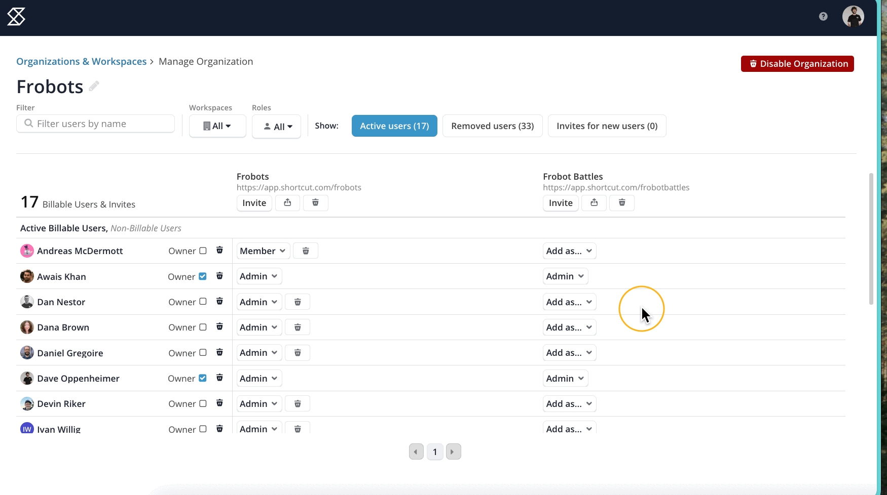
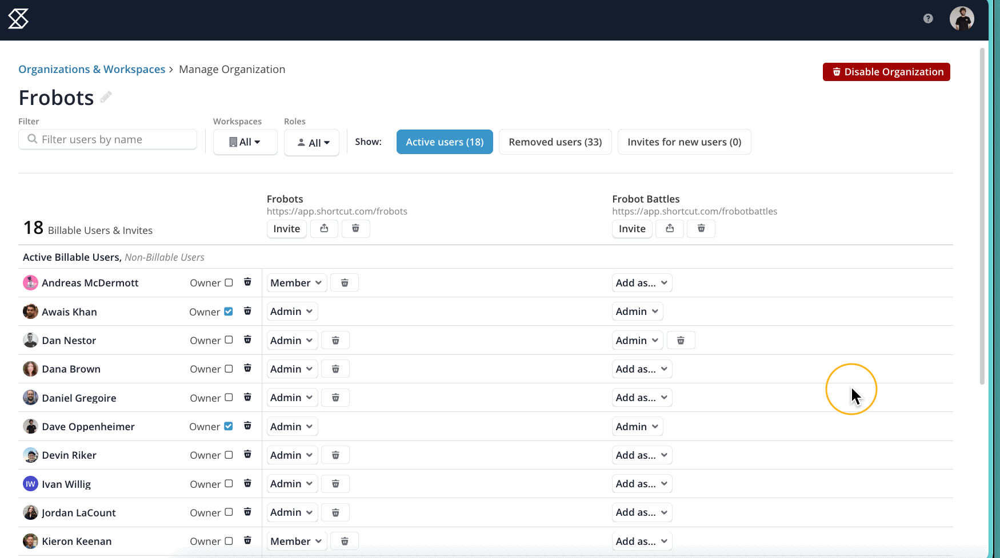
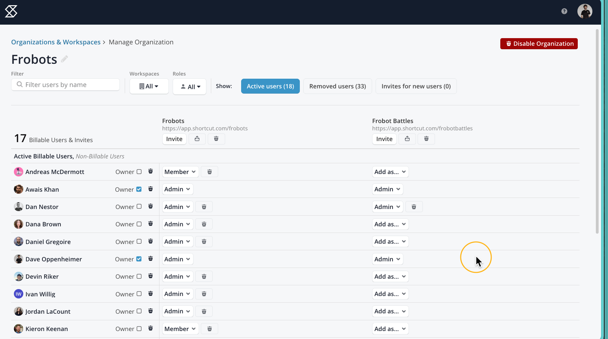

# Managing User Roles

User management can be performed from two places in Shortcut:

* The Workspace User Directory
* The Manage Organization and Workspaces page.

### The Workspace User Directory  

If you're an Owner or Admin and wish to change someone's role in your Workspace, go to **Settings > Workspace Settings > User Directory** and use the drop-down next to the person's name to change their role.

* To adjust a user's role, use the dropdown to the right of their name.
* To disable a user, click on the "no entry" symbol next to their user role.
* To re-enable a user, go to the **Disabled Users** tab and click on the "restore" icon next to their role.
  * If you encounter an error message, this means the user profile was entirely removed from the Organization, and you'll need Owner assistance (See the "Re-enable a user's membership in a Workspace" section below).

<figure><figcaption></figcaption></figure>

**Things to Note:**&#x20;

* Free plan accounts only have access to Admin roles and do not have access to Member or Observer roles. The Observer role is only available on the Team plan or above. For additional access, please consider [upgrading to a paid plan](https://app.clubhouse.io/settings/billing) that best suits your team's needs.
* The User Directory is for managing users at the Workspace level.
  * A disabled user will appear here even if they've been removed from the Organization by the Owner. As an Admin of a Workspace, if you try to re-enable a user who's been removed by an Owner, an invalid profile error message will show. An Owner will need to restore the user profile for the user in the Manage Organization and Workspaces page, and then the user can be re-invited to the Workspace.
* Only Owners can adjust other Owners and remove users entirely from an Organization, but this must be performed from the Manage Organization and Workspace page.

### The Manage Organization and Workspaces page 

If you are an Owner or Admin of an Organization, this page allows you to view and manage user membership and user roles across the entire Organization and all Workspaces, such as adding a user to a new Workspace, removing a user from the Organization entirely, or to promote/demote a user as an Owner (if you are an Owner already - more on this below).

**Note:** Only an Owner can manage another user's Owner status and permissions in a Workspace.&#x20;

<figure><figcaption></figcaption></figure>

### Add an existing user to another Workspace in your Organization 

<figure><figcaption></figcaption></figure>

1. Find the user’s row in the table.
2. In that user's row, click **Add as…** to get a drop-drown menu under the Workspace you'd like to add the user to, then choose their user role for that Workspace.

**Note:** Users can be associated with one Workspace, all Workspaces, or any combination of Workspaces that suit your Organization's needs. A user can also have different roles in different Workspaces; for instance, a user might be an Admin of Workspace A, be a Member in Workspace B, and need only Observer access to Workspace C.

### Change a user’s role in a Workspace 

<figure><figcaption></figcaption></figure>

1. Find the user’s row in the table.
2. In that user's row, click the role (Owner, Admin, or Member) drop-down menu under the desired Workspace, then choose a different role.

**Note:** Free plan accounts only have access to the Admin user role. For access to Member and Observer roles, please consider [upgrading to a paid plan](https://app.clubhouse.io/settings/billing). For more information about the different roles, see [Shortcut User Roles](https://help.clubhouse.io/hc/en-us/articles/360019189311-Clubhouse-User-Roles).

**To adjust a user to be an active Owner or demote from being an Owner:**

**Note:** This action can only be performed by another Organization Owner or via a Support action. If needing to transfer Ownership, see the _"Transferring ownership of an Organization to another user"_ section below.

* Find the user in the list or via Search
* Toggle Owner status on or off for that user
  * Ensure their user role is changed to reflect the permissions needed in each Workspace

### Remove a user's permission in a Workspace 

<figure><figcaption></figcaption></figure>

1. **Find** the user’s row in the table.
2. In that user's row, click the trashcan icon (**Disable user in this workspace.**) next to their role under the desired Workspace.
3. Their user role will turn grey and say **Disabled**

### Re-enable a user's permissions in a Workspace 

<figure><figcaption></figcaption></figure>

1. **Find** the user’s row in the table.
2. In that user's row, click the **Enable** button under the desired Workspace.

### Removing Users from your Organization 

**Note:** This action can only be performed by an Organization Owner.

A user can only be removed from an entire Organization after they have been disabled in every Workspace.

1. Once you've disabled the user in every Workspace using the trash can symbol next to their user role, click the **trashcan icon** next to their name. Upon hover-over, a message will appear that says: Remove from the Organization
2. Confirm the action and a pop-up message will appear in the lower right corner notifying you that the user was removed from the Organization.

**Note:** If you are an Organization Owner, to remove another Owner user from your Organization:

<figure><figcaption></figcaption></figure>

* First toggle Owner status off for that user
* Disable their user permissions in all Workspaces using the trash can symbol next to their user
* Select the trash can symbol next to their name to remove from the Organization entirely

### Re-enable users who've been removed from your Organization 

**Note:** Only an Organization Owner can re-enable a removed user.

<figure><figcaption></figcaption></figure>

1. Select the Removed Users option to view all removed users.
2. F**ind the user** you’d like to re-enable in the table.
3. Click the **Recycle icon** next to their name. You’ll see a confirmation message the user profile has been re-enabled and a note next to their name that says: “This user is now eligible to be re-invited to a Workspace through that Workspace's invite Settings screen.”

### Inviting New Users 

To invite new users to a specific Workspace inside the Manage Organization and Workspaces Dashboard, click the **Invite** button next to the Workspace name.

In the Invite dialogue, you’ll be able to enter the email address(es) and choose the desired user role. Click **Send Invitations** when you’re done.

**Note:** Free plan accounts can only invite new users as Admins. For access to invite users as Members or Observers, please consider [upgrading to a paid plan](https://app.clubhouse.io/settings/billing).

&#x20;

### Transferring ownership of an Organization to another user 

**If the current Owner is available:**

If you're the current Owner, you can transfer ownership of the Organization to another user.

1. Go to your [Organization and Workspaces Dashboard](https://app.shortcut.com/organizations) (click on your company's logo in the upper left corner, then click on **View All Workspaces**).
2. Once there, click on **Manage Organization and Workspaces.**
3. Find the user’s row in the table and toggle the **Owner** status on for that user.
4. You'll be asked to confirm the action.
5. Click **OK** to confirm

**If the current owner is no longer with your company or is not available:**

If the current owner is no longer with your company or is not available, we can change ownership of the account for you following a quick security measure. You will need to submit a written request to support@shortcut.com from an email address in the company's domain (if applicable) with a PDF document that contains the following:

* The account URL
* The name and email address of the previous account owner
* The name and email address of the new account owner
* The last four digits of the credit card number on file (if applicable)
* The billing address of the credit card on file (if applicable)

The information should be in a letter on your company letterhead, signed by a manager at your organization. If your company doesn't have letterhead, please be sure to include your company's mailing address and phone number in the letter.&#x20;

&#x20;
